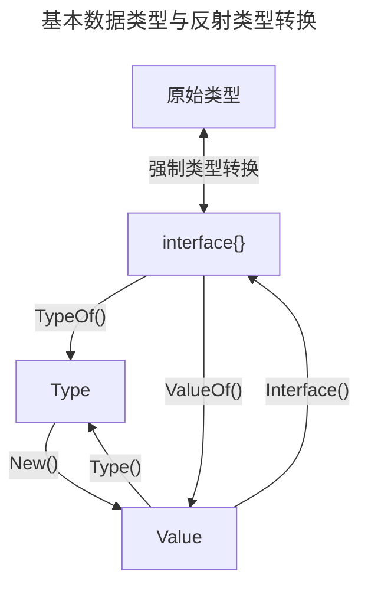

## 前言

反射（reflection）是在 Java 出现后迅速流行起来的一种概念，大多数现代的高级语言都以各种形式支持反射功能，但反射是把双刃剑，功能强大代码却不清晰。

各语言对反射的支持：

- C/C++ 语言没有支持反射功能，只能通过 typeid 提供非常弱化的程序运行时类型信息；
- Java、C# 等语言都支持完整的反射功能；
- Lua、JavaScript 等动态语言，由于其本身的语法特性就可以让代码在运行期访问程序自身的值和类型信息，因此不需要反射系统；

Go 语言程序的反射系统无法获取到一个可执行文件空间中或者是一个包中的所有类型信息，需要配合使用标准库中对应的词法、语法解析器和抽象语法树(AST)对源码进行扫描后获得这些信息。
Go语言中的反射是由`reflect`包提供支持的，反射最重要的两个概念：`Type`和`Value`。

- `reflect.Type`可以获取类型信息，通过`TypeOf()`函数得到；
- `reflect.Value`可以获取和修改值，通过`valueOf()`函数得到；

在反射中往往会判断类型(Type)与种类(Kind)：

- 当需要区分一个大的种类时，就会用到种类 Kind；
- 当需要根据类型创建一个变量时，就需要用到类型 Type；
- type 包括系统原生数据类型，如 int、string、bool、float64、map、struct 等类型，以及使用 type 关键字定义的类型，这些类型的名称就是其类型本身的名称。例如使用 type A struct{} 定义结构体时，A 就是 struct{} 的类型；

所有的种类(Kind)在`reflect/type.go`(line:241) 中有定义。  

```go
type Kind uint

const (
    Invalid Kind = iota  // 非法类型
    Bool                 // 布尔型
    Int                  // 有符号整型
    Int8                 // 有符号8位整型
    Int16                // 有符号16位整型
    Int32                // 有符号32位整型
    Int64                // 有符号64位整型
    Uint                 // 无符号整型
    Uint8                // 无符号8位整型
    Uint16               // 无符号16位整型
    Uint32               // 无符号32位整型
    Uint64               // 无符号64位整型
    Uintptr              // 指针
    Float32              // 单精度浮点数
    Float64              // 双精度浮点数
    Complex64            // 64位复数类型
    Complex128           // 128位复数类型
    Array                // 数组
    Chan                 // 通道
    Func                 // 函数
    Interface            // 接口
    Map                  // 映射
    Ptr                  // 指针
    Slice                // 切片
    String               // 字符串
    Struct               // 结构体
    UnsafePointer        // 底层指针
)
```

<!--  -->


## 1. reflect.Type

公共结构：

```go
type People interface {
	GetName() string
	GetAge() int
}

type User struct {
	Name        string      `json:"name"`
	age         int         `json:"age"`
	ContactInfo ContactInfo `json:"contact_info"`
}

// 值接收器的方法，值类型和指针类型都可以调用，因为 Go 会自动将指针对象解引用。换言之，值类型和指针类型都有这个方法
func (u User) GetName() string {
	return u.Name
}

// 指针接收器的方法，只能指针类型调用。换言之，只有指针类型有这个方法
func (u *User) GetAge() int {
	return u.age
}

type ContactInfo struct {
	Address string
	Phone   string
}

func Add(a, b int) int {
	return a + b
}
```

### 1.1 获取 Type

```go
fmt.Println(reflect.TypeOf(1))
fmt.Println(reflect.TypeOf("hello"))
utype := reflect.TypeOf(User{})
uptrType := reflect.TypeOf(&User{})
fmt.Printf("User Type: %s, Kind: %s\n", utype, utype.Kind())
fmt.Printf("*User Type: %s, Kind: %s, Elem Kind: %s\n", uptrType, uptrType.Kind(), uptrType.Elem().Kind())
fmt.Println(uptrType.Elem().Kind() == utype.Kind())
```

输出：

```go
int
string
User Type: main.User, Kind: struct
*User Type: *main.User, Kind: ptr, Elem Kind: struct
```

解析：

- `Elem()`方法用于获取指针指向的实际类型；

### 1.2 获取 struct 成员信息

```go
utype := reflect.TypeOf(User{})
uptrType := reflect.TypeOf(&User{})
fieldNum := utype.NumField()
for i := 0; i < fieldNum; i++ {
    field := utype.Field(i) // 通过下标访问成员
    fmt.Printf("index: %d, name: %s, offset: %d, anonymous: %t, type: %s, exported: %t, json tag: %s\n",
        i,                     // 下标
        field.Name,            //变量名称
        field.Offset,          //相对于结构体首地址的内存偏移量，string类型会占据16个字节
        field.Anonymous,       //是否为匿名成员
        field.Type,            //数据类型，reflect.Type类型
        field.IsExported(),    //包外是否可见（即是否以大写字母开头）
        field.Tag.Get("json")) //获取成员变量后面``里面定义的tag
}
// 也可以通过成员名获取，注意名称的大小写，一定要和结构体内的名称相同才能获取到
if name, ok := utype.FieldByName("Name"); ok {
    fmt.Printf("Name is exported: %t\n", name.IsExported())
}
// 也可以通过 FieldByIndex 获取嵌套 struct 的成员
field := utype.FieldByIndex([]int{2, 1}) // 按照数组中的值，依次访问结构体中下标的成员
fmt.Printf("User.ContactInfo second field name: %s\n", field.Name)
// 获取 struct 方法信息
tpuMethodNum := utype.NumMethod()
// 这里只能获取到 GetName 方法，因为它的接收器是值类型(main.User)，而变量 utype 就是值类型
for i := 0; i < tpuMethodNum; i++ {
    method := utype.Method(i)
    fmt.Printf("[User method] name: %s,type: %s, exported: %t\n",
        method.Name,         // 方法名
        method.Type,         // 方法签名
        method.IsExported(), // 包外是否可见（即是否以大写字母开头）
    )
}
tpupMethodNum := uptrType.NumMethod()
for i := 0; i < tpupMethodNum; i++ {
    method := uptrType.Method(i)
    fmt.Printf("[*User method] name: %s, type: %s, exported: %t\n",
        method.Name,         // 方法名
        method.Type,         // 方法签名
        method.IsExported(), // 包外是否可见（即是否以大写字母开头）
    )
}
```

输出：

```go
index: 0, name: Name, offset: 0, anonymous: false, type: string, exported: true, json tag: name
index: 1, name: age, offset: 16, anonymous: false, type: int, exported: false, json tag: age
index: 2, name: ContactInfo, offset: 24, anonymous: false, type: main.ContactInfo, exported: true, json tag: contact_info
Name is exported: true
User.ContactInfo second field name: Phone
[User method] name: GetName,type: func(main.User) string, exported: true
[*User method] name: GetAge, type: func(*main.User) int, exported: true
[*User method] name: GetName, type: func(*main.User) string, exported: true
```

解析：

- `FieldByIndex()`方法参数是一个数组，是因为结构体会有嵌套，数组中元素值就是结构体成员下标，依次深入取值。如果在访问最后一个下标前，成员不是 struct，则会引发 panic；
- 这里 User 的 Type 只能获取到一个方法，而 *User 的 Type 可以获取到两个方法，原因是`GetAge()`方法的接收器是指针类型(*User)。值类型(User)接收器可以被值类型(User)和指针类型(*User)调用，但指针类型(*User)接收器只能被指针类型(*User)调用。因此 User 无法调用`GetAge()`方法，即 User 没有`GetAge()`方法；

### 1.3 获取函数信息

```go
fType := reflect.TypeOf(Add)
fmt.Printf("Add() kind: %s, is function: %t\n", fType.Kind(), fType.Kind() == reflect.Func)
inNum := fType.NumIn() // 入参个数
for i := 0; i < inNum; i++ {
    tp := fType.In(i)
    fmt.Printf("[args in] index: %d, type: %s\n", i, tp)
}
outNum := fType.NumOut() // 出参个数
for i := 0; i < outNum; i++ {
    tp := fType.Out(i)
    fmt.Printf("[args out] index: %d, type: %s\n", i, tp)
}
```

输出：

```go
Add() kind: func, is function: true
[args in] index: 0, type: int
[args in] index: 1, type: int
[args out] index: 0, type: int
```

解析：

- 返回值是个数组，是因为 Go 的返回值可以有多个；

### 1.4 判断类型是否实现了某个接口

```go
utype := reflect.TypeOf(User{})
uptrType := reflect.TypeOf(&User{})
//通过 reflect.TypeOf((*<interface>)(nil)).Elem() 获得接口类型。因为 People 是个接口不能创建实例，所以把 nil 强制转为 *People 类型
ppType := reflect.TypeOf((*People)(nil)).Elem()
fmt.Printf("[People] kind: %s, is interface: %t\n", ppType.Kind(), ppType.Kind() == reflect.Interface)
// User 如果实现了接口，则 *User 也实现了接口
fmt.Printf("[User] implements People interface: %t\n", utype.Implements(ppType))
// *User 实现了接口，但 User 不一定实现了接口
fmt.Printf("[*User] implements People interface: %t\n", uptrType.Implements(ppType))
```

输出：

```go
[People] kind: interface, is interface: true
[User] implements People interface: false
[*User] implements People interface: true
```

解析：

- 上面提到`User`没有`GetAge()`方法，所以它没有实现`People`接口，自然也不是`People`类型；

## 2. reflect.Value

### 2.1 获取 Value

```go
fmt.Println(reflect.ValueOf(1))
fmt.Println(reflect.ValueOf("hello"))
uValue := reflect.ValueOf(User{})
fmt.Println(uValue)
uptrValue := reflect.ValueOf(&User{})
fmt.Println(uptrValue)
```

输出：

```go
1
hello
{ 0 { }}
&{ 0 { }}
```

解析：

- Value 中包含的是变量的值，而 Type 中包含的是变量的元信息；

### 2.2 Value 转为 Type

```go
uValue := reflect.ValueOf(User{Name: "Bobby", age: 22})
fmt.Println(uValue.Kind(), uValue.Type().Kind(), uValue.Kind() == uValue.Type().Kind())
uptrValue := reflect.ValueOf(&User{Name: "Bobby", age: 22})
fmt.Println(uptrValue.Kind(), uptrValue.Type().Kind(), uptrValue.Kind() == uptrValue.Type().Kind())
```

输出：

```go
struct struct true
ptr ptr true
```

解析：

- 在 Type 和 Value 上调用 Kind 方法，结果是一样的；

### 2.3 指针 Value 转换值 Value

```go
uptrValue := reflect.ValueOf(&User{})
elem := uptrValue.Elem()
fmt.Println(uptrValue.Kind(), elem.Kind())
ptr := elem.Addr() // 指针引用，获取指针 Value
fmt.Println(ptr.Kind(), elem.Kind())
// panic: reflect.Value.Addr of unaddressable value
fmt.Println(reflect.ValueOf(User{}).Addr().Kind())
```

输出：

```go
ptr struct
ptr struct
panic: reflect.Value.Addr of unaddressable value
```

解析：

- 对一个指针 Value 可以使用`Elem()`和`Addr()`相互转换；
- 于一个值 Value 使用`Addr()`会引发 panic；

### 2.4 得到 Value 原始的数据

```go
fmt.Println(reflect.ValueOf(1).Interface().(int), reflect.ValueOf(1).Int())
fmt.Println(reflect.ValueOf("hello").Interface().(string), reflect.ValueOf("hello").String())
uValue := reflect.ValueOf(User{Name: "Bobby", age: 22})
uptrValue := reflect.ValueOf(&User{Name: "Regan", age: 26})
user := uValue.Interface().(User)
fmt.Println(user.Name, user.age)
userPtr := uptrValue.Interface().(*User)
fmt.Println(userPtr.Name, userPtr.age)
```

输出：

```go
1 1
hello hello
Bobby 22
Regan 26
```

解析：

- 使用 Interface() 方法将 reflect.Value 变成 interface{}；
- 可以使用类型强转，或对应基本类型的方法`Int()`、`String()`等，一步到位获取原始值；

### 2.5 空 Value 判断

```go
var eface interface{}
iValue := reflect.ValueOf(eface)
fmt.Printf("[interface{}] IsValid: %t, vaifa kind is Invalid: %t\n", iValue.IsValid(), iValue.Kind() == reflect.Invalid)
var uptr *User = nil
uptrValue := reflect.ValueOf(uptr)
if uptrValue.IsValid() {
    fmt.Printf("[*User] IsNil: %t, IsZero: %t\n", uptrValue.IsNil(), uptrValue.IsZero())
}
var u User
uValue := reflect.ValueOf(u)
if uValue.IsValid() {
    fmt.Printf("[User] IsZero: %t\n", uValue.IsZero())
}
```

输出：

```go
[interface{}] IsValid: false, vaifa kind is Invalid: true
[*User] IsNil: true, IsZero: true
[User] IsZero: true
```

解析：

- 在调用`IsNil()`和`IsZero()`之前，一定要确保`uValue.IsValid()`为真，否则会引发 panic；
- 对于指针 Value 可以调用`IsNil()`和`IsZero()`，但对于值 Value 只能调用`IsZero()`，若调用`IsNil()`会引发 panic，因为值类型默认有零值，不能为 nil；

### 2.6 修改 Value 原始数值

```go
var i int = 10
iValue := reflect.ValueOf(&i)
iValue.Elem().SetInt(8)
fmt.Println(i)

var s string = "hello"
sValue := reflect.ValueOf(&s)
sValue.Elem().SetString("world")
fmt.Println(s)

user := User{Name: "Bobby", age: 22}
uValue := reflect.ValueOf(&user)
uValue.Elem().FieldByName("Name").SetString("Regan")
fmt.Println(user.Name)
fieldAge := uValue.Elem().FieldByName("age")
if fieldAge.CanSet() {
    fieldAge.SetInt(26)
} else {
    fmt.Println("User.age 未导出，不能被修改")
}
```

输出：

```go
8
world
Regan
User.age 未导出，不能被修改
```

解析：

- Go 默认是值传递，所以修改值时必须传指针；
- 使用`Elem()`方法获取指针指向的实际变量，才能修改变量值；
- 结构体中未导出的成员不能被修改；

### 2.7 修改 slice Value

```go
users := make([]*User, 1, 5) // len = 1, cap = 5
// 注意，通过下标赋值，与通过 Append() 方法追加元素，是不同的
users[0] = &User{Name: "Bobby", age: 22}
usValue := reflect.ValueOf(&users)
if usValue.Elem().Len() > 0 {
    usValue.Elem().Index(0).Elem().FieldByName("Name").SetString("Regan")
    fmt.Printf("first *User.Name change to: %s\n", users[0].Name)
}
// 也可以修改切片的 cap，但新的 cap 只能改小，且值只能在原 len 和 cap 之间
usValue.Elem().SetCap(3)
// 也可以把 len 改大，向切片追加元素
usValue.Elem().SetLen(2)
usValue.Elem().Index(1).Set(reflect.ValueOf(&User{Name: "Mayee", age: 20}))
fmt.Printf("second *User.Name: %s\n", users[1].Name)
```

输出：

```go
first *User.Name change to: Regan
second *User.Name: Mayee
```

解析：

- 可以修改切片的 cap，但新的 cap 只能改小，且值只能在原 len 和 cap 之间；
- 可以把 len 改大，但不能超过 cap；

### 2.8 修改 map Value

```go
// 注意，这里是 *User
umap := make(map[int]*User, 5) // len = 5, map 没有 cap 属性
umap[1] = &User{Name: "Bobby", age: 22}
mValue := reflect.ValueOf(&umap)
// SetMapIndex() 向 map 中添加一个 k-v 对
mValue.Elem().SetMapIndex(reflect.ValueOf(2), reflect.ValueOf(&User{Name: "Regan", age: 26}))
// 修改 map 中的元素
mValue.Elem().MapIndex(reflect.ValueOf(1)).Elem().FieldByName("Name").SetString("Mayee")
for k, u := range umap {
    fmt.Printf("key: %d, *User.Name: %s\n", k, u.Name)
}
```

输出：

```go
key: 2, *User.Name: Regan
key: 1, *User.Name: Mayee
```

解析：

- map 中的 v 必须是指针才可以被直接修改，若是值类型这回引发`panic: reflect: call of reflect.Value.Elem on struct Value`，因为值类型在 map 中是不可寻址的；

### 2.9 通过 Value 调用函数

```go
fValue := reflect.ValueOf(Add)
fType := reflect.TypeOf(Add)
inNum := fType.NumIn()
args := make([]reflect.Value, inNum)
for i := 0; i < inNum; i++ {
    if fType.In(i).Kind() == reflect.Int {
        args[i] = reflect.ValueOf(3) // 两个入参都给 3
    }
}
out := fValue.Call(args)
if fType.Out(0).Kind() == reflect.Int {
    sum := out[0].Int()
    fmt.Printf("Add() return: %d\n", sum)
}
```

输出：

```go
Add() return: 6
```

解析：

- 函数也是一种数据类型；

### 2.10 通过 Value 调用成员方法

```go
uptrValue := reflect.ValueOf(&User{Name: "Bobby", age: 22}) // 必须传指针，因为 GetAge() 方法的接收器是指针，只有指针对象才有这个方法
methodAge := uptrValue.MethodByName("GetAge")               // MethodByName() 指定名称找到对象的方法
ageOut := methodAge.Call([]reflect.Value{})                 // 如果方法没有参数，也要传一个空的切片
fmt.Printf("[*User] GetAge() return age: %d\n", ageOut[0].Int())
methodName := uptrValue.MethodByName("GetName")
nameOut := methodName.Call([]reflect.Value{})
fmt.Printf("[*User] GetName() return name: %s\n", nameOut[0].String())
uValue := reflect.ValueOf(User{Name: "Regan", age: 26})
method := uValue.MethodByName("GetName")
call := method.Call([]reflect.Value{})
fmt.Printf("[User] GetName() return name: %s\n", call[0].String())
```

输出：

```go
[*User] GetAge() return age: 22
[*User] GetName() return name: Bobby
[User] GetName() return name: Regan
```

解析：

- 调用成员方法时，若调用了类型不存在的方法会引发 panic；

### 2.11 通过 Value 创建 struct

```go
uType := reflect.TypeOf(User{})
uValue := reflect.New(uType) // 通过 Type 得到改对象的指针 Value
uValue.Elem().FieldByName("Name").SetString("Bobby")
u := uValue.Interface().(*User)
fmt.Printf("User.Name: %s\n", u.Name)
```

输出：

```go
User.Name: Bobby
```

解析：

- `New()`方法可以将 Type 转为 Value，得到的是指针类型的 Value；

### 2.12 通过 Value 创建 slice

```go
usType := reflect.TypeOf([]User{})
usValue := reflect.MakeSlice(usType, 1, 3)
usValue.Index(0).Set(reflect.ValueOf(User{Name: "Bobby", age: 22}))
us := usValue.Interface().([]User)
fmt.Printf("first User.Name: %s\n", us[0].Name)
```

输出：

```go
first User.Name: Bobby
```

解析：

- 使用`Index()`方法指定下标向切片插入元素；
- `MakeSlice`必须指定 len 和 cap；

### 2.13 通过 Value 创建 map

```go
mType := reflect.TypeOf(map[int]*User{})
mValue := reflect.MakeMapWithSize(mType, 10) // 或 reflect.MakeMap(mType)
mValue.SetMapIndex(reflect.ValueOf(1), reflect.ValueOf(&User{Name: "Bobby", age: 22}))
mValue.MapIndex(reflect.ValueOf(1)).Elem().FieldByName("Name").SetString("Regan")
umap := mValue.Interface().(map[int]*User)
fmt.Printf("User.Name: %s\n", umap[1].Name)
```

输出：

```go
User.Name: Regan
```

解析：

- 创建 map 时也可以使用`reflect.MakeMap()`方法不指定 len；

### 2.14 通过 Value 创建函数

```go
var fn func([]int) (int, error) // 定义一个函数签名
// 一定要传入指针
fnValue := reflect.ValueOf(&fn).Elem()
// 函数实现累加
makeFn := reflect.MakeFunc(fnValue.Type(), func(args []reflect.Value) (results []reflect.Value) {
    in := args[0]
    if in.Kind() != reflect.Slice {
        return []reflect.Value{reflect.ValueOf(0), reflect.ValueOf(errors.New("入参必传是切片"))}
    }
    if in.Index(0).Kind() != reflect.Int {
        return []reflect.Value{reflect.ValueOf(0), reflect.ValueOf(errors.New("切片类型必须是 int"))}
    }
    out := 0
    for i := 0; i < in.Len(); i++ {
        el := in.Index(i).Interface().(int)
        out += el
    }
    nilOut := reflect.Zero(reflect.TypeOf((*error)(nil)).Elem())
    return []reflect.Value{reflect.ValueOf(out), nilOut}
})
fnValue.Set(makeFn)
if ret, err := fn([]int{1, 2, 3}); err != nil {
    fmt.Println(err.Error())
} else {
    fmt.Println(ret)
}
```

输出：

```go
6
```

解析：

- 获取函数 Value 时，一定要使用指针；

## 3. 防坑实践

### 3.1 nil ≠ nil

开发中有时候会出现返回值明明是 nil，但是判断非空时却是 false。下面看一个实际的例子：

```go
package main

import "fmt"

// BizError 自定义业务 error
type BizError struct {
	Code int
	Msg  string
}

func (e *BizError) Error() string {
	return fmt.Sprintf("code: %d, msg: %s", e.Code, e.Msg)
}

type Biz struct {
}

func (b *Biz) First() error {
	fmt.Println("do First.")
	return nil
}

func (b *Biz) Second() *BizError {
	fmt.Println("do Second.")
	return nil
}

func (b *Biz) Finish() {
	fmt.Println("do Finish.")
}

func main() {
	b := new(Biz)
	err := b.First()
	if err != nil {
		fmt.Println("do First error")
		return
	}
	if err = b.Second(); err != nil {
		fmt.Println("do Second error")
		return
	}
	b.Finish()
}
```

代码解析：
- 我们自定义了一个错误`BizError`表示业务异常，并实现了`error`接口；
- 业务`Biz`有 3 个方法`First()`、`Second()`和`Finish()`，其中`First()`会返回`error`接口类型，`Second()`会返回`*BizError`类型，但`BizError`类型实现了`error`接口，所以它的值也是可以用`error`接收；

`First()`、`Second()`方法中最后都是返回了 nil，理论上会走到`Finish()`方法，但实际输出是：

```go
do First.
do Second.
do Second error
```

what? `Second()`明明返回的是 nil 啊，为什么在判断非空时却为真呢？难道这个 nil 有什么奇妙之处？

对于一个变量来说，它有两个要素：Type 和 Value。来看一个简单的例子：

```go
var it interface{}
fmt.Println(reflect.TypeOf(it), reflect.ValueOf(it)) // <nil> <invalid reflect.Value>
it = 1
fmt.Println(reflect.TypeOf(it), reflect.ValueOf(it)) // int 1
it = "hello"
fmt.Println(reflect.TypeOf(it), reflect.ValueOf(it)) // string hello

var s *string
it = s
fmt.Println(reflect.TypeOf(it), reflect.ValueOf(it)) // *string <nil>  关键地方
ss := "hello"
it = &ss
fmt.Println(reflect.TypeOf(it), reflect.ValueOf(it)) // *string 0xc00005c250
```

输出：

```go
<nil> <invalid reflect.Value>
int 1
string hello
*string <nil>
*string 0xc00005c250
```

在给一个 interface 变量赋值前，Type 和 Value 都是 nil，但给它赋值后，不仅会改变它的 Value，还会改变它的 Type。
当把一个值为 nil 的字符串指针赋值给它后，虽然它的值是 Value 是 nil，但它的类型 Type 却变成了 *string。
此时如果拿它来跟 nil 比较，结果就会是不相等，因为只有当这个 interface 变量的类型和值都未被设置时，它才真正等于 nil。

再来看看之前的例子中，err 变量的 Type 和 Value 是如何变化的：

```go
func main() {
	b := new(Biz)
	err := b.First()
	fmt.Println(reflect.TypeOf(err), reflect.ValueOf(err))
	if err != nil {
		fmt.Println("do First error")
		return
	}
	if err = b.Second(); err != nil {
		fmt.Println(reflect.TypeOf(err), reflect.ValueOf(err))
		fmt.Println("do Second error")
		return
	}
	b.Finish()
}
```

输出：

```go
do First.
<nil> <invalid reflect.Value>
do Second.
*main.BizError <nil>
do Second error
```

在一开始，我们给 err 初始化赋值时，`First()`方法返回的是一个`error`接口类型的 nil，此时查看其 Type 和 Value 时，都会是 nil。
而在调用`Second()`方法时，会将一个`*BizError`类型的 nil 值赋值给了它，此时它的 Type 便成了`*BizError`，Value 是 nil。
所以在做 err ≠ nil 的比较时，err 的 Type 已经不是 nil，前面已经说过，只有当一个接口变量的 Type 和 Value 同时为 nil 时，这个变量才会被判定为 nil，所以该不等式会判定为 true。

要修复这个问题，其实最简单的方法便是在调用`Second()`方法时给 err 进行重新声明：

```go
if err := b.Second(); err != nil {
    fmt.Println(reflect.TypeOf(err), reflect.ValueOf(err))
    fmt.Println("do Second error")
    return
}
```

此时，err 其实成了一个新的结构体指针变量，而不再是一个`interface`类型变量，类型为`*BizError`，且值为 nil，所以做 err ≠ nil 的比较时结果就是将是 false。

### 3.2 map 元素不可寻址

在开发中，当我们想修改 map 中的元素时可以怎么做呢？
下面看个例子：

```go
func main() {
	m := map[int]string{
		1: "A",
		2: "B",
	}
	fmt.Printf("%p\n",&m[1]) //cannot take the address of m[1]
}
```

此时程序编译是不通过的，会提示无法获取`&m[1]`的地址。
下面再看一个例子：

```go
func main() {
	m := map[int]string{
		1: "A",
		2: "B",
	}
	m[1] = "C"
    fmt.Println(m) //map[1:C 2:B]
}
```

此时 map 中的元素被成功修改。那这就有个疑惑：既然不能寻址，为何又可以修改呢？
我们接着看第三个例子：

```go
func main() {
	m := map[int]Person{
		1: Person{"Andy", 10},
		2: Person{"Tiny", 20},
		3: Person{"Jack", 30},
	}
	m[1].name = "TOM" // cannot assign to struct field m[1].name in map
	fmt.Println(m)
}

type Person struct {
	name string
	age  int
}
```

此时程序编译是不通过的，会提示无法分配给`m[1].name`地址。为什么这里又不能修改元素值了？
因为这个时候的`m[1]`是一个结构体`Person{"Andy", 10}`，它是不可寻址的，你要对不可寻址的结构体进行`.name`操作自然会报错。
它与第二个例子还是有区别的，在第二个例子中我们相当于是覆盖了`m[1]`这个值，而在本例中修改的是`m[1]`中的值，这个值无法被寻址，所以不能修改。

如果要对结构体修改值，可以通过新建变量，修改后再覆盖：

```go
func main() {
	m := map[int]Person{
		1: Person{"Andy", 10},
		2: Person{"Tiny", 20},
		3: Person{"Jack", 30},
	}
	p := m[1]
	p.name = "TOM"
	m[1] = p
	fmt.Println(m[1]) //{TOM 10}
}

type Person struct {
	name string
	age  int
}
```

或则可以通过**指针**：

```go
func main() {
	m := map[int]*Person{
		1: &Person{"Andy", 10},
		2: &Person{"Tiny", 20},
		3: &Person{"Jack", 30},
	}
	m[1].name = "TOM"
	fmt.Println(m[1].name) //TOM
}

type Person struct {
	name string
	age  int
}
```

因为 map 中存的是`Person`的指针，所以它是可以被寻址的。

---

::: note 本文参考

- [一篇带你全面掌握go反射的用法](https://zhuanlan.zhihu.com/p/411313885)
- [Golang reflect.Zero()实例讲解](http://www.manongjc.com/detail/30-grgtraautnirpkz.html)
- [Golang reflect.MakeFunc()用法及代码示例](https://vimsky.com/examples/usage/reflect-makefunc-function-in-golang-with-examples.html)
- [[Go疑难杂症]为什么nil不等于nil](https://www.cnblogs.com/mfrank/p/16831877.html)
- [Golang的map元素不可寻址](https://juejin.cn/post/7087535476071989261)

:::
