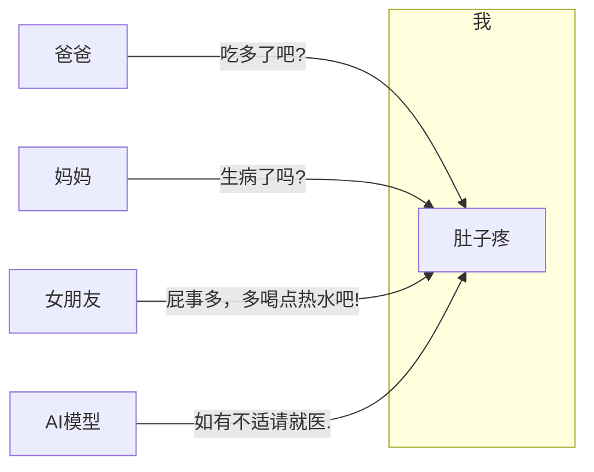

## 前言

早在 2023 年就掀起了一阵`ChatGPt`的热潮，一石激起千层浪。  
彼时火热的还有`Web3`、`区块链`、`元宇宙`等概念，它们之间也有一定的关系，利用`区块链`的技术链接在`Web3`中的万事万物共同构成这个`元宇宙`，在这个宇宙中，万事万物都是虚拟的，但又可以对应到现实中的个体，类似电影《头号玩家》中展示的那样。只不过在国内，这些概念还不成熟，`区块链`在某些方面(如：合同、数字人民币)有一些应用，其他可能涉及到欺诈或合规问题，导致没有较大的发展，但仍有小公司在做。  
而 AI 的发展却是如火如荼，各种国内外的 AI 工具层出不穷，如：ChatGPT、Claude、Gemini、Kimi、DeepSeek、智谱清言、千问、豆包、腾讯元宝，等等。  
这些发展成果离不开科技公司的研发迭代，也离不开政策支持，国家队站台推进。随着技术发展，逐渐出现了越来越多 AI 相关的概念及专有词汇，这么多的概念及其之间的关系，可能会导致我们对 AI 的认知不够，而不能够有效的去利用 AI。那么，我们接下来就去尝试理解。

## 1. AI 名词

在 AI 名词一波又一波的冲击下，逐渐出现了如：`Agnet`、`Function Calling`、`MCP`，它们都是什么意思？  
有人说`Agent`是`智能体`，那么`智能体`又是什么意思？  
有人说`MCP`是 AI 时代的 USB 接口，那 `MCP` 能插U盘吗？

接下来我们把`Prompt`、`Agnet`、`Function Calling`、`MCP`这几个概念串起来，说一说在 AI 的发展下，它们各自是什么，以及相互之间有什么关系。现在就开始吧！

### 1.1 User Prompt

早在 2023 年 OpenAI 公司发布 ChatGPT 时[+ChatGPT]，AI 看起来只是一个聊天框，我们通过聊天框发送一条消息给 AI 模型，模型就会给一个回复。我们发的消息就叫`User Prompt`，也叫用户提示词，一般是我们提出的问题或者想对 AI 模型说的话。如下所示：
[+ChatGPT]: 彼时还有卖号以及代注册的，从15到5块钱，从人工到批量，但那些批量怎么来的，能用多久，会不会黑号就难说了。

```sequence
用户 ->> AI模型: 你好(User Prompt)
AI模型 ->> 用户: 你好！有什么我可以帮你的吗？
```

但在现实生活中，面对不同身份的人，即便我们说出相同的话，对方也会根据自己的经历以及身份而给出不同的回复。而 AI 没有人设，就只会给出非常模板化的回答。当我说:“肚子疼”时不同角色给出的回应：



但是 AI 这种四平八稳的回答就显得很无趣，于是我们给 AI 加上人设。最直接的方式是，把人设信息和我们要说的话打包成一条`User Prompt`发给 AI，如：`你扮演我女朋友，我现在肚子疼`，然后 AI 就可能回复：`我肚子也疼！`，这样就对味了。  
但是`你扮演我女朋友`这句话并不是我们想对 AI 说的话，每次对话都加上这句挺出戏的。于是我们把这句人设信息单独拎出来，放到另一个`Prompt`中，这就是`System Prompt`，即系统提示词。

### 1.2 System Prompt

`System Prompt`主要用来描述 AI 的角色、性格、背景信息、语气等，总之就是一种固定状态的设置。不需要用户每次都告诉 AI 的信息，都可以放进系统提示词，设置一次就持续生效。  
当用户每次把`User Prompt`发给 AI 时，系统会自动把`System Prompt`一起发给 AI，这样对话就显得自然多了。比如 ChatGPT 网页版有`自定义 ChatGPT`设置，这些预设就会成为系统提示词的一部分。

### 1.3 Agent

不过，即使`System Prompt`设置的再完美，说到底它也只是个聊天机器人，顶多给你一些参考性回答，实际还是得自己动手操作，那能不能让它自己完成任务呢？  
第一个做出这种尝试的是一个叫[AutoGPT](https://github.com/Significant-Gravitas/AutoGPT)的开源项目，它是一个本地运行的小程序。如果你想让 AI 帮你管理电脑上的文件，那就需要写一些文件管理的函数，如：列出/创建目录、上传/下载、移动/复制、读写文件等，然后把这些函数及描述和使用方法注册到 AutoGPT 中，AutoGPT 会自动根据这些信息生成`System Prompt`，告诉 AI 模型你有哪些工具，这些工具都是干什么的，以及 AI 如果要使用这些工具该返回什么格式(如，我要调用`read_dir`)，最后把这些`System Prompt`和`User Prompt`一同发给 AI 模型(如`帮我打开 host 文件目录`)。如果 AI 模型够聪明就会按照要求的格式返回给 AutoGPT，接着 AutoGPT 解析后执行相应的函数，再把函数结果返回给 AI 模型，然后 AI 再根据函数结果决定下一步该做什么。这个过程就一直反复，直到完成用户的要求。  
其实，像 AutoGPT 这种在**AI模型**、**(函数)工具**、**用户**之间传话的程序就叫做 AI `Agent`，理解为 AI 代理人的意思。这些提供给`Agent`的函数/服务/库等也叫做`Agent Tool`。

不过，这种模式还是存在一些小问题，虽然我们在`System Prompt`中写清楚了 AI 应该用什么格式返回，但 AI 它是一种概率模型，相同的问题不是每次返回得都一样，那就可能会存在返回格式不对的情况。  
为了应对这种情况，很多`Agent`就会在发现 AI 返回的格式不正确时**自动重试**，比如[Cline](https://cline.bot/)仍采用这种模式，但这种反复尝试总归让人感觉不靠谱，并且`Agent`的开发需要处理重试的情况，最关键的是返回重试会带来更多额外的 Token 开销。  
于是一些大模型厂商，如：ChatGPT、Claude、Gemini 等，纷纷推出了叫做`Function Calling`的功能，这种功能的核心思想是：统一格式、规范描述。

### 1.4 Function Calling

回到之前的例子，当我们需要 AI 帮我打开 host 文件目录时，我们通过`System Prompt`告诉 AI 有哪些工具和应该返回什么格式，但这些描述是用自然语言随意写的，只要意思表达清楚就行。而`Function Calling`对这些描述进行了标准化，比如每个`Agent Tool`都用一个 JSON 对象来定义：

```json :no-line-numbers
{
  "name": "list_dir",
  "desc": "列出目录",
  "params": {
    "path": "str"
  }
}
```

然后这些 JSON 对象也从`System Prompt`被剥离出来，单独放到一个字段中。`Function Calling`也规定了 AI 模型使用工具时返回格式，所以格式描述也可从`System Prompt`中去掉。这样一来，所有`Agent Tool`都统一放在相同的位置，工具描述也都是相同的格式，AI 使用工具后的回复也都依照相同的格式，于是就能更加有针对性的训练 AI 模型，让它里理解这种调用场景。此时如果 AI 模型还是生成了错误的返回格式时，但由于正确的返回格式已经明确指定了，AI 服务器就能检测到错误，于是就在服务器端自动重试，用户端不会感知到错误，降低了`Agent`的开发难度，同时也节省了重试的 Token 开销。  
正是由于这些好处，越来越多的 AI `Agent`从`System Prompt`转向了`Function Calling`。

可`Function Calling`也有问题，就是它没有统一的标准。每个大模型厂商的 API 定义都不一样，甚至一些开源模型还不支持`Function Calling`，所以要写一个跨模型通用的`Agent`是挺麻烦的。因此`System Prompt`和`Function Calling`这两种方式目前在市面上是并存的。

### 1.5 MCP

前面说的都是`Agent`和 AI 模型之间的通信方式，接下来说说`Agent`和`Agent Tool`是怎么通信的。  
最简单的方式就是把`Agent`和`Agent Tool`写在一个程序中，直接通过函数调用即可，这也是当前大多数`Agent`的做法。但这样其实耦合性比较高，有些`Agent Tool`是统一的，比如，浏览网页、读取文件、查找目录等，可能多个`Agent`有一部分相同的功能，总不能把相关函数在每个`Agent`中都写一次吧，这样要维护的时候就很麻烦。于是就有了一个办法，把所`Agent Tool`变成服务统一托管，所有的`Agent`都来调用服务，这就是`MCP`(Model Context Protocol, 模型上下文协议)。  
`MCP`是一种通信协议，专门用来规范`Agent`和`Agent Tool`服务之间的交互，运行`Agent Tool`服务叫做 MCP Server，调用它的`Agent`叫做 MCP Client。MCP 规定了 Server 与 Client 之间如何通信，以及 Server 需要提供哪些接口，比如要有，可以查询 Server 中有哪些 Tool 的接口，Tool 的描述、参数、返回格式的接口 等。除了可以调用 Tool 的这种方式来获取数据，MCP 服务也可以直接提供数据，如 提供文件读写的服务叫做 Resource，为 Agent 提供提示词模板的叫 Prompt。MCP Server 和 Agent 可以不在一台服务器上，然后通过 HTTP 进行通信。

虽然 MCP 是为了 AI 而制定出来的通信标准，但它本身和 AI 模型没有关系，它不关心 Agent 用的哪种 AI 模型，它只是负责帮 Agent 管理 Tool、Resource 和 Prompt。

## 2. 组合流程

在熟悉了这些 AI 名词后，我们来梳理下，看看一个组合后的流程是什么样的。

```sequence 组合 AI 调用流程
我 ->> Agent(MCP Client): 1. 肚子疼怎么办?
Agent(MCP Client) ->> Tool(MCP Server): 2. 给我所有 Tool 的信息
Tool(MCP Server) -->> Agent(MCP Client): 3. 所有 Tool 的信息是 xxx
Agent(MCP Client) ->> AI模型: 4. [UserPrompt]:肚子疼怎么办?[SystemPrompt/FunctionCalling]:<所有Tool信息>
AI模型 ->> Agent(MCP Client): 5. (直接/FunctionCalling回复): 你的问题要调用WebBrowser这个Tool
Agent(MCP Client) ->> Tool(MCP Server): 6. 使用WebBrowser把问题查询的结果给我
Tool(MCP Server) -->> Agent(MCP Client): 7. (查询到一些信息): xxx, xxx, xxx
Agent(MCP Client) ->> AI模型: 8. 调用了WebBrowser后查询到了一些信息: xxx, xxx, xxx
AI模型 ->> Agent(MCP Client): 9. (思考一番后回复): 屁事多，多喝点热水吧!
Agent(MCP Client) ->> 我: 10. 屁事多，多喝点热水吧!
```

通过这个流程，我们可以看出：`System Prompt`、`User Prompt`、`Agent`、`Agent Tool`、`Function Calling`、`MCP`、`AI模型`之间的关系了。它们不是取代关系，而是相互结合，像齿轮一样传动，一起构成了AI自动化协作的完整体系。

## 3. 结语

AI 的猛烈发展给现代社会带来了不小的冲击，有些人会担心被 AI 取代而感到焦虑，在未来 AI 发展到什么程度我们不得而知，但从历史来看，每一次的技术革新，人们都是被时代的洪流推着向前走，新的变革也会带来新的机遇。既然如此，何不干脆积极面对技术革新，享受新技术带来的改变，在机遇中寻找发展。它也许会改变我们过去的生活/工作方式，但学会适应变化，新的方式可能会更好！

::: note 本文参考

- [10分钟讲清楚 Prompt, Agent, MCP 是什么](https://www.bilibili.com/video/BV1aeLqzUE6L?spm_id_from=333.788.player.switch&vd_source=3176ee7b546aa5c6726ec17363c3bb02)
:::
