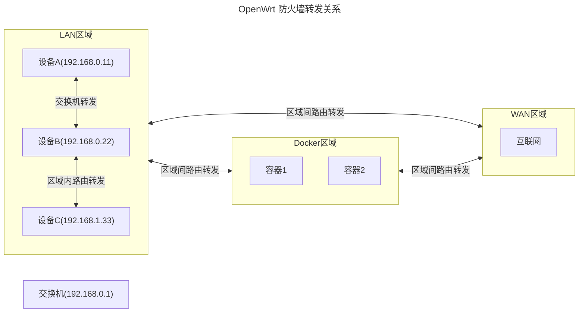

## 前言

在上一篇文章[家庭网络配置](/article/ajedbv3c/)中提到我的 R2S 刷了[YAOF](https://github.com/QiuSimons/YAOF)的固件后，网速能跑带宽，猜测可能是`LAN`口与`WAN`口交换的缘故，而在后来的折腾中发现好像不是这样，可能单是因为`iStoreOS`的固件跑不满带宽。  
之所以有了这篇文章，是因为我需要在软路由的 Docker 中部署几个电视直播源(部署方式见[电视直播相关汇总](/article/pqozqzh6/))，但是 Docker 分区下的磁盘空间太小了，下载启动了两个容器就没空间了。于是在网上寻找`Docker分区扩容`的方法，其中有个简单的方式就是创建一个新分区，然后挂载路径为 Docker 根目录`/opt/docker`，但是操作完后没有达到预期效果，后来继续寻找方法，最终促使我将`YAOF`的固件替换为了`ImmortalWrt`的固件。实际上YAOF固件貌似也是基于ImmortalWrt固件编译的，选择YAOF就是拿来直接用，选择ImmortalWrt则更精简，便于自定义。

## 1. 固件选择

`OpenWrt`是一个针对嵌入式设备的路由器系统(Linux操作系统)，常见固件：官方Openwrt、ImmortalWrt、Lean固件、iStoreOS等。  
官方OpenWrt在国外，软件包商店需要代理访问，而ImmortalWrt针对中国用户做了优化，软件包商店可直接访问，并且跟随官方更新。

固件下载地址：[OpenWrt](https://firmware-selector.openwrt.org/)、[ImmortalWrt](https://firmware-selector.immortalwrt.org/)。输入设备型号搜索(如：R2S)，然后下载固件即可，这里我选择的是 ImmortalWrt 固件。

### 1.1 EXT4 和 SQUASHFS 怎么选

详细的解释请见[「扫盲帖」ext4/sfs 固件怎么选择，有什么区别](https://github.com/QiuSimons/YAOF/discussions/511)、[ext4和sfs有什么区别](https://github.com/QiuSimons/YAOF/discussions/114)，或者自行 Google 搜索。  
简单点来说，SQUASHFS 可以重置、扩容镜像和直接升级，而 EXT4 都不能。  
对于 arm 设备推荐 SQUASHFS 固件，对于 x86 设备推荐 EXT4 固件。由于 R2S 是 arm 设备，这里我选择的是 SQUASHFS 固件。

## 2. 分区扩容

### 2.1 安装前扩容(推荐)

安装前扩容也就是对镜像扩容，仅针对 SQUASHFS 格式。扩容镜像需要在 Linux 环境下，可以是 Openwrt、Debian、Ubuntu 等。这种操作方式相对简单，更推荐使用。

:::steps

1. 检查命令

   分别执行`which gzip`、`which dd`、`which parted`命令，检查这些软件是否存在，若不存在则安装，安装方式在不同 Linux 发行版上稍有差异，但都很简单，具体 Google。

2. 上传固件

   把下载好的固件(如：`immortalwrt-24.10.0-rockchip-armv8-friendlyarm_nanopi-r2s-squashfs-sysupgrade.img.gz`)上传至 Linux 环境中，上传位置随意。  
   这里，我是在 Windows 系统中启用 WSL2 运行了 Ubuntu 系统，打开`powershell`输入`wsl`命令连接到 Ubuntu 系统(具体请见[WSL2使用](/article/ryxmiytl/))。  
   WSL 和 Windows 系统之间文件交换有个小技巧，在命令行中任意目录下输入`explorer.exe .`就能在资源管理器中打开当前目录；或者手动打开资源管理器，然后在地址栏中输入`\\wsl$\`就能打开WSL系统中的目录，然后直接复制粘贴文件即可。

3. 执行命令

   按顺序执行以下命令(命令中的镜像名字根据实际填写)。注意，如果是 EFI 的固件，在执行这些命令过程中可能会弹出 2 项提示，分别选择：`OK`、`FIX`即可。

   ```shell:no-line-numbers
    
    # 解压缩镜像文件，解压完成后这个文件就没用了，可删
    gzip -kd immortalwrt-24.10.0-rockchip-armv8-friendlyarm_nanopi-r2s-squashfs-sysupgrade.img.gz
    
    # 解压成功后获得到 immortalwrt-24.10.0-rockchip-armv8-friendlyarm_nanopi-r2s-squashfs-sysupgrade.img
    
    # 扩展镜像文件的大小 (count=2048 表示增加 2048 * 1MB 的空间)
    # 注意扩容也不是越大越好，因为扩容会增大镜像的体积，这意味着镜像大小将会增加 2GB。
    dd if=/dev/zero bs=1M count=2048 >> immortalwrt-24.10.0-rockchip-armv8-friendlyarm_nanopi-r2s-squashfs-sysupgrade.img
    
    # 使用分区工具操作镜像
    parted immortalwrt-24.10.0-rockchip-armv8-friendlyarm_nanopi-r2s-squashfs-sysupgrade.img
    
    # 查看分区情况
    print
    
    # 调整分区大小 (将第 2 个分区扩展至镜像文件的 100%)
    # 也就是将第 2 个分区大小加了 2GB，这个分区一般是用来安装插件使用的。
    resizepart 2 100%
    
    # 查看是否扩展成功
    print
    
    # 退出分区工具
    quit

   ```

   之后把`immortalwrt-24.10.0-rockchip-armv8-friendlyarm_nanopi-r2s-squashfs-sysupgrade.img`文件拷贝到 Windows 系统中，然后直接刷入这个固件即可。刷入固件的操作步骤在[软路由之R2S使用](/article/3ocurxag/)一文中有详细记录，这里便不再赘述。

:::

### 2.2 安装后扩容

建议先配置好 OpenWrt 的网络，使之可以访问互联网，因为接下来可能需要安装软件。

::::tabs
@tab SQUASHFS 格式
:::steps

1. 更新软件包

   在`系统`>`软件包`页面点击`更新列表`

2. 安装分区工具

   在`系统`>`软件包`页面搜索`diskman`，然后选择`luci-i18n-diskman-zh-cn`安装。刷新页面后可在`系统`菜单下看到`磁盘管理`。

3. 禁用自动挂载

   在`系统`>`挂载点`>`全局设置`区域，取消勾选所有的自动挂载项，然后点击`保存并应用`。

4. 创建分区

   在`系统`>`磁盘管理`>`磁盘`区域点`编辑`，然后在弹出页面的`分区信息`中最下方，`中止扇区`位置填写`+2g`(根据自己需要调整大小，支持的容量格式有：b,k,m,g,t，如：+500m，+1t 等)，格式化为 EXT4 文件系统，然后点击`新建`，即可创建一个 2GB 空间大小的分区。  
   注：中止扇区的计算方式，以增加 2GB 为例：((2\*1024\*1024\*1024)/512)+[起始扇区]-1，得到的结果即为中止扇区的值。

5. 挂载分区

   在`系统`>`挂载点`>`挂载点`区域点击`添加`，在`常规设置`一栏的`UUID`选中刚刚创建的分区(记下分区名)，`挂载点`选择`作为根文件系统使用(/)`。然后复制下方显示出来的多行命令，暂存到记事本中，之后点击`保存`，再点击`保存并应用`。

6. 执行命令

   使用`ssh root@192.168.100.1`登录到系统(这里`root`是用户名，`192.168.100.1`是软路由系统的地址，根据实际情况填写)，将刚才复制的多行命令中，其中`/dev/sda1`修改为`/dev/实际创建的分区名`，然后复制粘贴到命令行窗口，多点几次回车，直到执行完成。

7. 重启系统

   重启软路由系统。

:::

@tab EXT4 格式
:::steps

1. 更新软件包

   在`系统`>`软件包`页面点击`更新列表`

2. 安装分区工具

   在`系统`>`软件包`页面搜索`diskman`，然后选择`luci-i18n-diskman-zh-cn`安装。刷新页面后可在`系统`菜单下看到`磁盘管理`。

3. 禁用自动挂载

   在`系统`>`挂载点`>`全局设置`区域，取消勾选所有的自动挂载项，然后点击`保存并应用`。

4. 创建分区

   在`系统`>`磁盘管理`>`磁盘`区域点`编辑`，然后在弹出页面的`分区信息`中最下方，`中止扇区`位置填写`+2g`(根据自己需要调整大小，支持的容量格式有：b,k,m,g,t，如：+500m，+1t 等)，格式化为 EXT4 文件系统，然后点击`新建`，即可创建一个 2GB 空间大小的分区。  
   题外话：中止扇区的计算方式，以增加 2GB 为例：((2\*1024\*1024\*1024)/512)+[起始扇区]-1，得到的结果即为中止扇区的值。

5. 挂载分区

   在`系统`>`挂载点`>`挂载点`区域点击`添加`，在`常规设置`一栏的`UUID`选中刚刚创建的分区(记下分区名)，`挂载点`例如为`/mnt/sda3`，sda3 可随意命令，目的是拷贝overlay文件用。之后点击`保存`，再点击`保存并应用`。

6. 执行命令

   使用`ssh root@192.168.100.1`登录到系统(这里`root`是用户名，`192.168.100.1`是软路由系统的地址，根据实际情况填写)，执行命令`cp -r /overlay/* /mnt/sda3`，将原overlay下的配置拷贝至新分区。

7. 检查分区

   查看新分区目录是否拷贝成功，如果成功则在`系统`>`挂载点`>`挂载点`区域删除刚才的`/mnt/sda3`挂载。

8. 重新挂载分区

   再次进入`系统`>`挂载点`>`挂载点`区域点击`添加`，选择刚才的新分区，`挂载点`选择为`作为外部 overlay 使用(/overlay)`，之后点击`保存`，再点击`保存并应用`。

9. 重启系统

   重启软路由系统。

:::

::::

## 3. 安装 Docker

在安装 Docker 前，我们可以先安装`argon`主题。在`软件包`页面更新列表后，搜索`argon`，然后选择`luci-theme-argon`安装即可，如果需要设置主体再安装`luci-i18n-argon-config-zh-cn`。  
Docker 使用的根目录通常是`/opt/docker`，在安装之前，最好手动创建一个分区并挂载到`/opt/docker`，否则若直接安装 Docker 会自动创建分区挂载到根目录下，那样会限制使用。

:::steps

1. 创建分区

   进入`系统`>`磁盘管理`>`磁盘`区域点`编辑`，然后在弹出页面的`分区信息`中最下方，`中止扇区`位置填写`+20g`(根据个人需求，+10g也行)。如果有使用`AdGuardHome`的需求，必须将分区格式化化为`btrfs`，否则亦可格式化为`ext4`。

2. 挂载分区

   进入`系统`>`挂载点`>`挂载点`区域点击`添加`，选择刚才的新分区，`挂载点`为`/opt/docker`，之后点击`保存`，再点击`保存并应用`。

3. 安装 Docker

   在`系统`>`软件包`页面点击`更新列表`，然后搜索`docker`，然后选择`luci-i18n-dockerman-zh-cn`安装。  
   安装完成后建议等上3~5分钟，后台可能有操作没执行完。之后刷新页面后可在菜单下看到`Docker`。

:::

启动 Docker 后便可在`Docker`>`概览`中看到`Docker 根目录`的空间大小。亦可通过 ssh 命令进入到软路由系统中，使用`df -h /opt/docker`查看 Docker 分区大小。

之后便可部署直播源或者其他容器啦~~

## 4. 配置防火墙

上面在部署完直播源后，容器运行正常，查看日志也正常，通过 ssh 进入到软路由系统中去访问 Docker 容器也正常，但就是使用其他非软路由设备无法访问到 Docker 容器。  
这大概率就是防火墙不通导致，于是了解了下 OpenWrt 防火墙的概念。下面这个图表达了防火墙各设备之间的概念关系。




这里有几个概念：转发、出入站。

- 转发：区域内相同网段(192.168.0.\*)由交换机直接转发，不受防火墙控制；区域内不同网段(192.168.0.\*与192.168.1.\*)以及区域间的转发，由路由转发，受防火墙控制。
- 出入站：这里的站是指路由器，流入路由器的数据就是入站，流出路由器的数据就是出站。

在了解了上述这些之后，可以想到，`LAN区域`->`Docker区域`必须能转发，并且`Docker区域`->`WAN区域`必须也能转发，所以防火墙的配置如下图所示。


至此，便可正常获取到电视直播源并且观看了。

OpenWrt 的折腾暂时告一段落~~

## 5. 配置PWMFAN

原版的 R2S 固件中是有 pwmfan 的，也就是根据 CPU 温度控制风扇是否启用。但由于我们刷的是并非原版固件，所以当前固件中是没有这个设置的，只能通过脚本方式来执行。

:::steps

1. 下载脚本

   ```bash
      # 下载 start-rk3328-pwm-fan.sh
      wget -P /usr/bin https://raw.githubusercontent.com/friendlyarm/friendlywrt/refs/heads/master-v19.07.1/target/linux/rockchip-rk3328/base-files/usr/bin/start-rk3328-pwm-fan.sh
      # 下载 fa-rk3328-pwmfan
      wget -P /etc/init.d https://raw.githubusercontent.com/friendlyarm/friendlywrt/refs/heads/master-v19.07.1/target/linux/rockchip-rk3328/base-files/etc/init.d/fa-rk3328-pwmfan
   ```

2. 执行脚本

   ```bash
      # 添加执行权限
      chmod +x /usr/bin/start-rk3328-pwm-fan.sh
      chmod +x /etc/init.d/fa-rk3328-pwmfan
      # 执行脚本
      /etc/init.d/fa-rk3328-pwmfan enable
      /etc/init.d/fa-rk3328-pwmfan start
   ```

:::

## 6. 官方源

如果不小心删掉了官方源，则可以在后台`系统`->`软件包`点击`配置 opkg`:

- `/etc/opkg.conf`: 一般不需要改动。仅在需要修改安装目录或设置代理时手动配置。
- `/etc/opkg/customfeeds.conf`: 一般不需要改动。仅在需要添加第三方源或本地仓库时手动配置。
- `/etc/opkg/distfeeds.conf`: 必须配置。官方源的核心配置文件，确保正确填写以访问官方软件包。

```text title="distfeeds.conf" :no-line-numbers
src/gz base https://downloads.immortalwrt.org/releases/24.10.1/packages/aarch64_generic/packages
src/gz luci https://downloads.immortalwrt.org/releases/24.10.1/packages/aarch64_generic/luci
src/gz packages https://downloads.immortalwrt.org/releases/24.10.1/packages/aarch64_generic/base
src/gz routing https://downloads.immortalwrt.org/releases/24.10.1/packages/aarch64_generic/routing
src/gz telephony https://downloads.immortalwrt.org/releases/24.10.1/packages/aarch64_generic/telephony
```

**注意**：`24.10.1`是系统版本，`aarch64_generic`是 CPU 架构，要根据实际情况填写。


## 7. 固件编译

官方固件[下载](https://firmware-selector.immortalwrt.org/)页提供了个性化编译的界面，可以增加预安装软件包(得是官方源有的才行)，和首次运行脚本。这里我提供一个脚本如下：

```bash
#!/bin/sh
# /etc/uci-defaults/99-setup.sh

# 设置 LAN 口 ip
uci set network.lan.proto='static'
uci set network.lan.ipaddr='192.168.0.1'
uci set network.lan.netmask='255.255.255.0'

# 设置 pppoe 拨号
#uci set network.wan.proto='pppoe'
#uci set network.wan.username='123456'
#uci set network.wan.password='123456'

# 设置访问光猫
uci set network.modem=interface
uci set network.modem.proto='static'
uci set network.modem.ipaddr='192.168.1.254'
uci set network.modem.netmask='255.255.255.0'
uci set network.modem.ifname='eth0'
uci set network.modem.defaultroute='0'

# 提交生效
uci commit network

exit 0
```

此脚本会在首次启动时自动运行，正常退出后会自动删除该脚本。

---

## 8. IPv6配置

为了内网中的服务能被公网通过 IPv6 访问(访问内网的 Sub-Store 服务)，还需要做如下两处设置(仅适用于主路由模式下)，默认情况下它们都是`已禁用`：


::: note 本文参考

- [openwrt基础配置](https://www.qichiyu.com/183.html#heading-2-1)

:::
