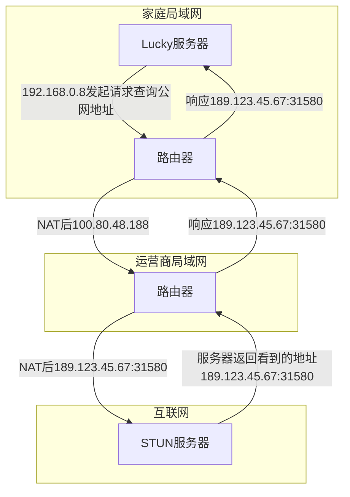
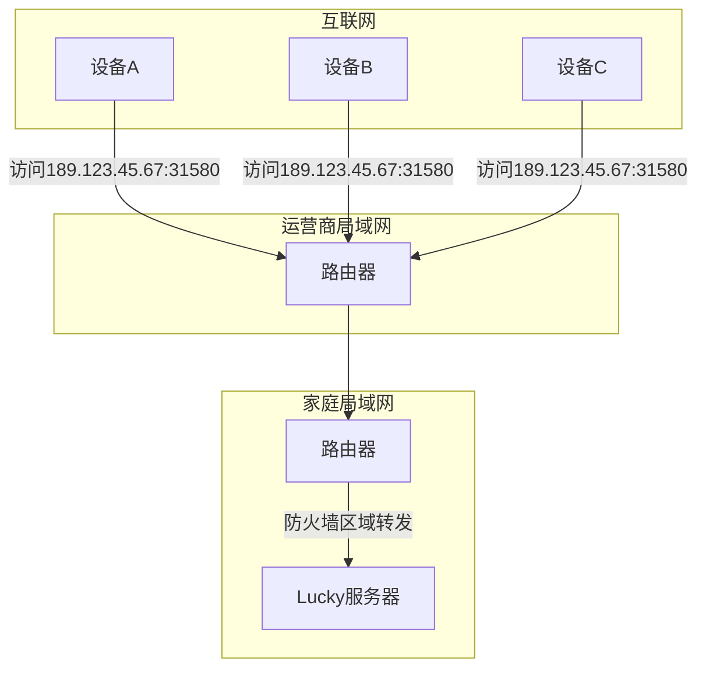
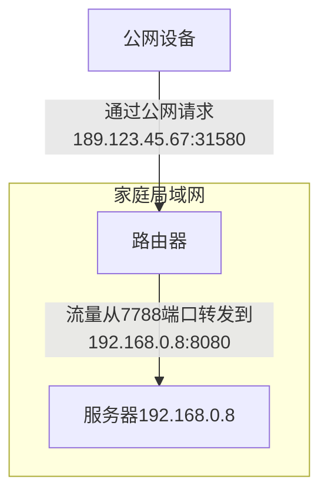

## 前言

之前有写过[Lucky内网穿透实践](/article/r9qcnh6l/)[+lucky_pass]，其中介绍了利用 Lucky 做内网穿透的使用方式，今天继续介绍搭配 Cloudflare 的使用技巧。
[+lucky_pass]: **访问密码**: `pub558787`(双击复制)

多说一句，内网穿透的方式很多，有商业付费方案，付了钱开通账号直接用；也有个人付费方案，买个轻量云主机，搭建 frp、wireguard、tailscale derp 节点等。但那些都不在本次讨论范围内，多数使用场景下都不是必要付费的，而本文要说的是，纯免费打造媲美付费效果的内网穿透方案。

开始本文前，一个假设的前提是已经利用 Lucky 做好了 Stun 内网穿透，如果没有建议先看[Lucky内网穿透实践](/article/r9qcnh6l/)。  
**能够实现效果**：==通过一个域名无端口访问到内网，且支持双栈网络访问==。

**开始前的准备**：
1. 一个 Cloudflare 账号。如果没有先去官网免费[注册](https://cloudflare.com)；
2. 至少一个域名，并指向了 Cloudflare 的 DNS 服务器。如果没有可以从[DigitalPlat](https://digitalplat.org)、[DNSHE](https://www.dnshe.com)免费获取，然后托管到 Cloudflare；

## 1. 穿透原理

我认为在进行一项新事务前，如果时间允许的话，应该先了解其工作原理。如果直接上手，会导致做的过程中云里雾里，很容易在无意中出错，然后花费大量时间排查，效率极其低下。  
而实现了解原理也有助于自身评估，是否需要花费精力操作，因为每个人有不同的使用场景，没有永远的银弹，只有适合自己的才是最好的方案。

首先，在 FullCone NAT 的网络模式下，Lucky 会利用 STUN 协议打洞，在运营商的路由器上打通一个 NAT 映射，并维持住这个映射，之后任意客户端都可以通过这个映射到内网服务。



这就是 STUN 打洞的过程：内网服务依次通过家庭路由器和运营商路由器两层NAT，每一次的NAT都会在路由器上留下一个地址和端口的映射，最终以一个公网身份请求同样处于公网的STUN服务器。接着STUN服务器返回响应，回传这个公网地址，那么内网服务就知道了自己的公网身份了，只要维持住这个映射，那么任意设备就可以通过访问这个公网地址达到内网服务了。

其中`100.80.48.188`这个是运营商大内网中的地址，如果在同一运营商网络(移动/联通/电信)下，是可以拿这个地址访问的；而`189.123.45.67:31580`就是真正的公网地址，任意运营商网络下的设备都可以访问到。



从大的角度看，外部网络访问到内网的过程是这样，而内网中又如何将请求转发到实际提供服务的机器上呢？



这里要说名明的一下，我的 Lucky 是部署在主路由的 OpenWrt 上，光猫桥接用主路由拨号。如果你不能设置光猫桥接，或者 Lucky 没有部署在主路由上，那就需要用到 DMZ 或者 Upnp 把 Lucky 需要穿透的端口映射到拨号设备上。  
举例：通过 Lucky 设置 STUN 穿透时，要指定一个`穿透通道本地端口`，假如是`7788`。这个意思是，由于公网的 ip 和 port 是动态的、随机的，指不定什么是否就会变的，但是本地得监听一个固定的端口，那么公网流量通过`31580`这个随机端口访问进来，流量到了路由器后实际是到了`eth0`这个网卡的`7788`端口。

路由器上通常都可以看到`WAN`口和`LAN`口，其中`WAN`口接的是光猫，连接到的是外部网络，而外部流量进来也是到达了`eth0`网卡，当拨号上网成功时，这个网卡就会被运营商分配一个 ip(100.80.48.188)；`LAN`口是内网交互的网口，对应的网卡名通常是`eth1`，它的 ip 通常是静态的，也就是我们常常设置的 192.168.0.1。

我们内网中的设备通常都是 192.168.0.x，也就是说它和`eth1`网卡是通的，但刚刚我们说外部流量是打到了`eth0`的 7788 端口。那我们就需要把`eth0`的 7788 端口上到流量转发到`eth1`上某个 ip 的某个端口上，这个转发操作可以在路由器上的防火墙设置`端口转发`，也可以直接让 Lucky 内部自行转发，但推荐使用防火墙那的`端口转发`，因为那是内核级的转发，性能会更高一些，资源占用也会更低一些。

**重要**：==Lucky 服务千万不能经过任何网络代理，即使把模式设置为直连也不行，因为代理软件为了做规则分流，通常会接管所有的 DNS 请求，统一返回 fakeip，这会导致 Lucky 的 STUN 穿透无法获取到正确的公网 ip==。

## 2. DDNS分流

Lucky 的功能很强大，除了可以帮我们获取到公网地址，可以做 DDNS 将公网 ip 同步到 DNS 记录中。假设我们上面准备的域名是`happy.de5.net`，如果把ipv4 和 ipv6 的地址都记录到`happy.de5.net`和`*.happy.de5.net`，到时候公网该如何访问？  
在当前的网络环境下，我们是通过 STUN 拿到的 ipv4 公网，地址和端口都是动态的，而非原生的公网地址，但 ipv6 的公网地址是原生的。  
假设内网中反代服务监听了端口 666 转发到后端的 8080 端口，如果外网设备用 ipv6 地址访问时，就应该用`https://happy.de5.net:666`，通过固定的端口就可以了；但是如果外网用的是 ipv4 访问时，就应该用`https://happy.de5.net:31580`，通过随机端口访问，并且这个随机端口还是会变的。可是外网设备一般不会主动选择用 ipv4 还是 ipv6 发起请求，这取决于设备所处的网络环境。而通常家用路由器的 ipv6 开关是关闭的，这种情况下就拿不到 ipv6 地址，别人无法通过 ipv6 访问你，而没有 ipv6 地址的设备更是无法访问你。

有人可能会说，可以设置 SRV 记录啊，支持同时记录 ip 和 端口号，确实是，Lucky 也支持 SRV 记录，但问题是：不是所有的设备都支持查询 SRV 记录，比如浏览器就不会，它只会找 A/AAAA 记录，也就是去查询你的 ipv4/ipv6 地址，如果查不到记录，那就报错。

> 似乎没有优解方案了？

别着急，我们换个角度想想，既然合在一起不行，那干脆就把 ipv4 和 ipv6 分开来设置，然后外部请求时统一用一个入口，根据来源 ip 类型将请求实际打到我们的 ipv4 或 ipv6 地址上去。这个意思不就和反向代理差不多了吗？Ok，既然想清楚了，那就开始干。

> 申请证书及 DDNS

Lucky 确实很强大，你可能需要的网络相关的东西，它都提供给你了，包括证书申请及续期。操作起来非常简单，具体看开头提到的文章，这里只说思路。

我们分别为`*.v4.happy.de5.net`和`*.v6.happy.de5.net`这两个泛域名申请证书，前缀可以随意，这里用`v4`和`v6`主要是为了见名知意。然后利用 Lucky 提供的 DDNS 功能，将 ipv4 地址解析到`*.v4.happy.de5.net`，将 ipv6 地址解析到`*.v6.happy.de5.net`。==注意==：不要勾选`指定代理状态`。如果勾选了，在 Cloudflare 上托管域名的 DNS 记录就会被代理，显示一个黄色的云朵，也就是常说的`小黄云`。

> 为什么不要开启小黄云？

一旦开启了小黄云，你的 DNS 记录就会被 Cloudflare 代理，表现为：当你 ping `v4.happy.de5.net` 或 `v6.happy.de5.net` 的任意子域名时，得到的是 Cloudflare 的泛ip，而非你自己的真实ip。好处是可以隐藏你的真实 ip，并且享受 cloudflare 带来的安全防护，坏处是支持访问的端口有限，stun 拿到的公网端口都是随机的，很可能就是 cloudflare 不支持的，并且也不能被 workers 和 pages 访问。  
当开启了小黄云时，你的服务器对于 cloudflare 来说就是源站，公网请求到 cloudflare，cloudflare 到源站的这个过程叫做“回源”。

## 3. 重定向规则

如果说上一个步骤是分离，这个步骤就是合并。通过访问一个域名 https://ok.happy.de5.net，根据访问者的 ip 类型，浏览器自动重定向到 https://ok.v4
.happy.de5.net:31580 或 https://ok.v5.happy.de5.net:666。要实现这个效果就得利用 Cloudflare 的`重定向规则`。

点击托管在 Cloudflare 上的域名`happy.de5.net`，接着在左侧菜单找到`规则`->`概述`，点击`创建规则`。  
我们可以为 ipv4 和 ipv6 分别创建规则。

### 3.1 创建 ipv4 重定向规则

**编辑单一重定向**

规则名称：home-redirect-v4

**如果传入请求匹配…**

选择`自定义筛选表达式`

**当传入请求匹配时...**

|字段|运算符|值|条件|
|:-:|:-:|:-:|:-:|
|主机名|等于|*.happy.de5.net|And|
|IP源地址|包含以下各项|0.0.0.0/0||

表达式预览
> (http.host eq "*.happy.de5.net" and ip.src in {0.0.0.0/0})

**则...**

URL 重定向

|类型|表达式|状态码|
|:-:|:-:|:-:|
|动态|wildcard_replace(http.request.full_uri, "https://\*.happy.de5.net/\*", "https://\${1}.v4.happy.de5.net:31580/\${2}")|307|


勾选`保留查询字符串`

---

上述说明：

1. ip 来源值为 0.0.0.0/0，就表示匹配所有的 ipv4 地址。
2. https://\*.happy.de5.net/\* 这里的 \* 就是占位符，可以指代任意字符串。https://\${1}.v4.happy.de5.net:31580/\${2} ，这里 \${1} 就表示引用第 1 个 \* 的内容， ${2} 表示引用第 2 个 \* 的内容，以此类推。
3. 307/302 表示临时重定向， 305/301 表示永久重定向。如果永久重定向的话，浏览器会记住重定向后的地址，这里我们当然要用临时重定向。而 302 是历史遗留产物，不规范，无论重定向前是哪种请求方式，重定向后都变成了 GET 请求，这就可能会丢失请求 body，而 307 就很好的保留了原始的请求方式。

**重定向规则这里有个问题**

举例，原始请求：https://okk.happy.de5.net/best，重定向后：https://okk.v4.happy.de5.net/best:31580。  
31580 是 STUN 拿到的动态公网端口，一旦发生了变化这条重定向规则就走不通了。

好在 Cloudflare 的设置都提供了 api 方式修改，我们完全可以在 STUN 的 WebHook 处来发起一个请求来修改重定向规则。

具体步骤如下：

1. 获取 Api 令牌

点击右上角`个人简介`->`配置文件`，再点击左侧菜单中的`API令牌`，在`API令牌`区域点击`创建令牌`->`自定义令牌`。

令牌名称：随意

权限：  
`账户` `账户规则集` `编辑`  
`区域` `单一重定向` `编辑`

帐户资源：  
`包括` `{你的账户}`

区域资源：  
`包括` `特定区域` `happy.de5.net`

接着保存并记下 Api令牌。

2. 获取区域(Zone)ID

点击托管的域名，将页面拉到最下面，就可以看到`区域ID`。

3. 获取重定向规则集ID

发起如下请求：
```plain
GET https://api.cloudflare.com/client/v4/zones/{区域ID}/rulesets
Authorization: Bearer {Api令牌}
```

在响应结果中搜索`http_request_dynamic_redirect`，这一项的 id 就是重定向的`规则集ID`。

4. 获取重定向规则

发起如下请求：
```plain
GET https://api.cloudflare.com/client/v4/zones/{区域ID}/rulesets/{规则集ID}
Authorization: Bearer {Api令牌}
```

在响应结果中就可以看到刚刚设置的重定向规则`home-redirect-v4`，这一项的 id 就是`规则ID`。

5. 修改重定向规则

发起如下请求：
```plain
PATCH https://api.cloudflare.com/client/v4/zones/{区域ID}/rulesets/{规则集ID}/{规则ID}
Authorization: Bearer {Api令牌}

{
  "description": "home-redirect-v4",
  "enabled": true,
  "expression": "(http.host eq \"*.happy.de5.net\" and ip.src in {0.0.0.0/0})",
  "action": "redirect",
  "action_parameters": {
    "from_value": {
      "preserve_query_string": true,
      "status_code": 307,
      "target_url": {
        // 假设 STUN 获取到的最新公网端口是 25778
        "expression": "wildcard_replace(http.request.full_uri, \"https://*.happy.de5.net/*\", \"https://${1}.v4.happy.de5.net:25778/${2}\")"
      }
    }
  }
}
```

### 3.2 创建 ipv6 重定向规则

**编辑单一重定向**

规则名称：home-redirect-v6

**如果传入请求匹配…**

选择`自定义筛选表达式`

**当传入请求匹配时...**

|字段|运算符|值|条件|
|:-:|:-:|:-:|:-:|
|主机名|等于|*.happy.de5.net|And|
|IP源地址|包含以下各项|2000::/3||

表达式预览
> (http.host eq "*.happy.de5.net" and ip.src in {2000::/3})

**则...**

URL 重定向

|类型|表达式|状态码|
|:-:|:-:|:-:|
|动态|wildcard_replace(http.request.full_uri, "https://\*.happy.de5.net/\*", "https://\${1}.v6.happy.de5.net:666/\${2}")|307|


勾选`保留查询字符串`

---

说明：和 ipv4 的重定向规则差不多，`2000::/3`包含了所有的 ipv6，表示匹配所有的 ipv6 地址。但重定向的端口可以是固定的 666，因为 ipv6 是原生的公网 ip，所以就不需要像 ipv4 那样通过 api 来修改规则了。当然，如果想修改也行，跟修改 ipv4 重定向规则一样的方式。

发起如下请求：
```plain
PATCH https://api.cloudflare.com/client/v4/zones/{区域ID}/rulesets/{规则集ID}/{规则ID}
Authorization: Bearer {Api令牌}

{
  "description": "home-redirect-v6",
  "enabled": true,
  "expression": "(http.host eq \"*.happy.de5.net\" and ip.src in {2000::/3})",
  "action": "redirect",
  "action_parameters": {
    "from_value": {
      "preserve_query_string": true,
      "status_code": 307,
      "target_url": {
        "expression": "wildcard_replace(http.request.full_uri, \"https://*.happy.de5.net/*\", \"https://${1}.v6.happy.de5.net:666/${2}\")"
      }
    }
  }
}
```

### 3.3 设置 DNS 记录

最后还有一个重要的步骤，手动为`happy.de5.net`设置两个 DNS 记录。

|类型|名称|内容|代理状态|TTL|
|:-:|:-:|:-:|:-:|:-:|
|A|@|192.0.2.1|启用|自动|
|A|*|192.0.2.1|启用|自动|

这两个记录一定要打开小黄云，才能触发重定向规则。其中`192.0.2.1`是一个非常特殊的 IP 地址，在 RFC 5737 规范中，它是仅用于演示、举例、写书的一个地址，不是一个有效的主机地址。你也可以设置为 0.0.0.0，随便都可以。这也就是为什么证书只申请`*.v4.happy.de5.net`和`*.v5.happy.de5.net`，而`happy.de5.net`和`*.happy.de5.net`不需要证书，因为它们指向的不是有效的主机，TCP 三次握手都完成不了，更别提后面的 Client Hello 拿证书了。根域名的作用仅仅是用来做重定向。

---

经过上面的操作，我们就可以做到通过浏览器访问一个地址，自动重定向到不同的子域，支持双栈网络访问。

但是有但是，这种方式只适合用于浏览器环境，对于一些 api 服务来说，你返回给它 302/307 根本不行，它只认 200，不是就报错。并且这还可能有资源跨域问题。浏览器地址栏有端口号丑不说，还会暴露真实的 ip 地址。

那我们就换一种方式，结合 worker 来做。

## 4. Worker 反代
### 4.1 Workers 说明

Cloudflare 这个赛博善人提供了 Workers&Pages。Workers 可以在边缘节点上执行 Serverless 函数，Pages 则可以托管静态网站，同时也能执行 Serverless 函数。

Pages 的功能很好理解，它就类似于 GitHub Pages、Vercel、Netlify 可以托管静态网站，不过 GitHub Pages 不能执行函数，Vercel 和 Netlify 可以。当前这个博客就是托管在 Vercel 和 Netlify 上。

Workers 的功能似乎有点看不懂，什么是边缘节点？什么是 Serverless？能执行什么函数？

> 什么是边缘节点？

首先“节点”指的就是 Cloudflare 的服务实例。Cloudflare 在全球各地都有机房，因此节点也就遍布全球。

“边缘”指的就是网络位置距离你最近的地方，因此“边缘节点”指的就是在网络位置上离你最近的那个 Cloudflare 服务实例。

因为你在 Workers 上部署的函数，Cloudflare 会自动同步到全球各个节点上去，如果你没做“Worker路由规则”或其他防护，任何人都可以访问到你的函数。  
假设 Cloudflare 在香港、东京、洛杉矶、首尔有节点，这些节点上都会存在你的函数，香港朋友如果要访问你的函数，就近原则就会请求到香港节点；美国朋友如果要访问你的函数，就近原则就会请求到洛杉矶节点。这么做的好处很明显，全球任何位置的人都就近访问边缘节点，能有效降低延迟。

其实类似的我们还听过“边缘网关”，尤其是智能家居物联网场景下，各种设备通过WIFI、蓝牙或者Zigbee互联，总得需要一个中枢(相当于指挥中心)，这个中枢就是网关，因为网关处于内网中，在网络上离我们最近，因此也叫做“边缘网关”。 
我们还听说过“边缘计算”呢，比如你的小爱音箱或者天猫精灵，它就是一个“边缘网关”，当我们给它发送指令，有些是简单指令，比如“定个闹钟”、“xx分钟后提醒我”、“打开主灯”，这些指令都是小爱音箱自身就能计算并完成的，就是“边缘计算”；而对于一些复杂指令，比如“最近的国际局势”、“分析过去两周的黄金走势”，这些就会发送到小米服务器(云端)计算，也就是“云计算”。  
“边缘计算”的优势在于快，免去网络延迟开销就能完成任务；“云计算”的优势在于强大，能完成更复杂且多样性的任务。当然在 AI 发展的今天，边缘网关的硬件也可以内置一些小模型，支持在本地做一些复杂计算和分析任务了。

> 什么是 Serverless？

传统意义上，我们编码写了几个函数，无论是什么语言，如果要提供访问，就得启动一个服务器，监听 TCP/UDP，一个或多个端口。也就是说，要想提供服务就得有 Server，我们还得维持这个 Server 运行，一旦 Server 停止，函数也就无法执行了。  
而 Serverless 就是让我们不用创建 Server，更不用关心 Server 的存在，函数部署到 Worker 上就能提供访问。既然连 Server 的不用创建，也就无需维持 Server 了。

传统服务器计费按照 CPU(规格、频率、核数)、内存、硬盘、带宽、流量等多种维度计费。你一旦买了服务器，这些费用就产生了，即使你没用放在那吃灰，那也是要给钱的，因此成本就相对较高。  
而 Serverless 的 CPU(规格、频率、核数)、内存、硬盘、带宽、流量等都是共享的，当你的函数需要运行，Cloudflare 会调度 CPU 给你执行，按照执行时间收费，不执行就不收费，其他资源也是同样的，用多少花多少。要是不用放那吃灰，那就不收你钱，可以说优势很明显。

> 能执行什么函数？

可以用 Node.js 写函数，比如：正向代理、反向代理、管理系统等等，结合Cloudflare 提供的免费 KV、D1、R2 等多种存储方式，可以实现更多功能。

### 4.2 资源限制

Cloudflare 真的是相当慷慨，即使是免费账户，提供的资源也是非常的充裕，个人使用很难触及上限。

比如，Workers&Pages 每日请求最大限额 10W 次。这里指的是单个账户下所有 Workers&Pages 的请求次数总和。

每个 Worker 中函数执行的最大 CPU 时间是 10ms，这意味着只要不是做复杂的加/解密，死循环，批量读写大文件，几乎是达不到这个限制的。而 KV 存储更是每日 1000次写操作，10W 次读操作。

### 4.3 部署函数

为了规避前面重定向的一些问题，我们可以借助 Worker 来做一个反向代理服务，代码如下：
```js title="_worker.js" :collapsed-lines=15
// 定义KV键名
const KV_KEY_PORT = "stun_port";

export default {
  async fetch(request, env, ctx) {
    // 处理POST API请求，用于更新端口
    const url = new URL(request.url);
    if (request.method === "POST" && url.pathname === "/api/stun") {
      try {
        // 验证Token
        const authHeader = request.headers.get("Authorization");
        const expectedToken = env.TOKEN;

        if (!authHeader || !expectedToken) {
          return new Response(JSON.stringify({ error: "Unauthorized: Missing token." }), {
            status: 401,
            headers: { "Content-Type": "application/json" },
          });
        }

        const parts = authHeader.split(" ");
        if (parts.length !== 2 || parts[0] !== "Bearer" || parts[1] !== expectedToken) {
          return new Response(JSON.stringify({ error: "Unauthorized: Invalid token." }), {
            status: 401,
            headers: { "Content-Type": "application/json" },
          });
        }

        // 解析JSON请求体
        const body = await request.json();
        const port = body.port;

        // 验证port值
        if (!port || typeof port !== "number" || port < 1 || port > 65535) {
          return new Response(JSON.stringify({ error: "Invalid port number." }), {
            status: 400,
            headers: { "Content-Type": "application/json" },
          });
        }

        // 2. 保存到KV (必须转为字符串)
        await env.KV_STORE.put(KV_KEY_PORT, port);

        return new Response(JSON.stringify({ code: 0, success: true }), {
          status: 200,
          headers: { "Content-Type": "application/json" },
        });
      } catch (err) {
        return new Response(JSON.stringify({ error: "Processing error: " + err.message }), {
          status: 400,
          headers: { "Content-Type": "application/json" },
        });
      }
    }

    // 获取客户端IP
    const ipHeaders = ["cf-connecting-ip", "x-forwarded-for", "x-real-ip", "true-client-ip"];
    let clientIP = null;
    for (const header of ipHeaders) {
      const ip = request.headers.get(header);
      if (ip) {
        clientIP = header === "x-forwarded-for" ? ip.split(",")[0].trim() : ip;
        break;
      }
    }

    if (!clientIP) {
      return new Response(JSON.stringify({ error: "Bad Request: Unknown client ip." }), {
        status: 400,
        headers: { "Content-Type": "application/json" },
      });
    }

    // 1. 根据IP版本确定主后端
    let primaryBackend;
    if (clientIP.includes(":")) {
      primaryBackend = `https://${env.BACKEND_V6}`;
    } else {
      // IPv4地址 - 动态获取端口
      const v4Port = await env.KV_STORE.get(KV_KEY_PORT);
      if (v4Port) {
        primaryBackend = `https://${env.BACKEND_V4}:${v4Port}`;
      } else {
        primaryBackend = null;
      }
    }

    // 2. 尝试请求主后端
    if (primaryBackend) {
      try {
        const reqClone = request.clone();
        return await sendToBackend(reqClone, primaryBackend);
      } catch (err) {
        // 主后端失败，继续到兜底逻辑
      }
    }

    // 3. 兜底
    try {
      return await sendToBackend(request, `https://${env.BACKEND_FB}`);
    } catch (fallbackErr) {
      return new Response("Service Unavailable", { status: 503 });
    }
  },
};

async function sendToBackend(originalRequest, backendUrl) {
  const url = new URL(originalRequest.url);
  const targetUrl = new URL(url.pathname + url.search, backendUrl);

  const newReq = new Request(targetUrl, {
    method: originalRequest.method,
    headers: originalRequest.headers,
    body: originalRequest.body,
    redirect: "follow",
    signal: AbortSignal.timeout(5000) // 使用超时信号
  });

  newReq.headers.set("Host", targetUrl.hostname);
  
  // 发送请求并验证结果
  const response = await fetch(newReq);
  
  // 状态码不是200则认为失败，抛出错误让调用方处理
  if (response.status !== 200) {
    throw new Error(`Backend returned non-200 status: ${response.status}`);
  }
  
  return response;
}
```
打开 Cloudflare 主页下左侧菜单`计算和AI`->`Workers 和 Pages`，右上角`创建应用程序`，名称随意。  
部署完后，在Worker的`设置`->`变量和机密`添加一个`TOKEN`。然后在左侧`存储和数据库`->`Workers KV`创建一个实例，名称随意。然后在创建的 Worker 中`绑定`选择刚刚创建的 KV 实例，绑定名称为`KV_STORE`。

建议可以放弃 url 重定向那套玩法，除非特别需要。这样我们就可以移除掉`happy.de5.net`和`*.happy.de5.net`这两个 DNS 记录，然后可以给 Worker 绑定一个域名，如`happy.de5.net`，可以把`okk.happy.de5.net`绑定给 Tunnel。前端只需要访问`happy.de5.net`，Worker 会自动帮我们代理进行后端访问，同样支持双栈网络。

当然，完全可以注册多个域名，因为`DigitalPlat`免费就可以注册两个域名，`DNSHE`最多可以免费注册5个域名。

访问策略如下：
1. 如果是 ipv4 地址连接就转发到`*.v4.happy.de5.net`，否则转发到`*.v6.happy.de5.net`。
2. 如果上述请求不成功，则转发到 Tunnel 进行兜底。

因此，实际上我们是结合使用了内网穿透的 3 种方式：STUN、V6、Tunnel。

## 5. Tunnel

前面提到了 Cloudflare Tunnel，它也是一种内网穿透方式，通过内网运行 Tunnel 实例，一个实例下有 4 个连接器，分别会连接到不同的 Cloudflare 节点，做服务端的高可用方案。Tunnel 自身还提供了客户端高可用的方案，只要用相同的配置起多个 Tunnel 实例，它们会自动管理连接，单节点故障转移。

下载[Tunnel](https://developers.cloudflare.com/cloudflare-one/networks/connectors/cloudflare-tunnel/downloads/)并在内网中任意一台设备上运行，或者直接下载Docker[镜像](https://hub.docker.com/r/cloudflare/cloudflared)用容器跑也行。当然，也有 OpenWrt 的版本。

Cloudflare 上要在主页左侧菜单点击`Zero Trust`->`网络`->`连接器`，创建隧道。  
然后拿着`隧道ID`和`令牌`，填写配置文件：

```yaml title="config.yaml"
# 配置文件参数：
# - https://developers.cloudflare.com/cloudflare-one/networks/connectors/cloudflare-tunnel/configure-tunnels/cloudflared-parameters/run-parameters/
# - https://developers.cloudflare.com/cloudflare-one/networks/connectors/cloudflare-tunnel/configure-tunnels/cloudflared-parameters/origin-parameters/
tunnel: Sub-Store
credentials-file: /root/.cloudflared/{隧道ID}.json
# edge-ip-version: "4"
# protocol: http2 # quic
metrics: 0.0.0.0:20241
loglevel: info
# 暴露私网到 CF 的网络中(和 tailscale 的 subnet 一个意思，客户端需要使用 WARP 并启用 zero trust，同样要开 VPN)
warp-routing:
  enabled: false
ingress:
  - hostname: okk.happy.de5.net
    service: http://192.168.0.8:3001
  - service: http_status:404
```

另外还需要一个证书，[访问](https://dash.cloudflare.com/argotunnel)，选择`happy.de5.net`这个域名，点击下载证书`cert.pem`。

```yaml title="compose.yaml"
services:
  cloudflared:
    image: cloudflare/cloudflared:latest
    container_name: cloudflared
    environment:
      - TUNNEL_TOKEN={令牌}
      - TUNNEL_ORIGIN_CERT=/etc/cloudflared/cert.pem
      - NO_AUTOUPDATE=true
    network_mode: host
    restart: unless-stopped
    command: tunnel --config /etc/cloudflared/config.yml run
    volumes:
      - ./cloudflared:/etc/cloudflared
```

然后在公网访问`happy.de5.net`请求就会到达内网的`http://192.168.0.8:3001`。

Cloudflare 的 Tunnel 使用和 Tailscale 的 Funnel 类似。区别在于 Funnel 强制走 derp 中转会很慢，Tunnel 网速就很好。  
Cloudflare warp 和 Tailscale 的 subnet 又很像，都是可以暴露子网，又都需要使用各自的客户端起启用 VNP 访问。区别在于 Cloudflare 使用的 WARP 在国内已经连不上了，而 Tailscale 客户端还能正常用，它的 subnet 很好用。

## 6. 总结

至此，不提 Tailscale 我们一共有 5 种内网穿透的使用方式：单ipv4(STUN)、单ipv6(原生)、Tunnel(兜底)、URL重定向、加密隧道(VPN)，其中最后这种方式在本文的开头提到的文章中有详说，这里不再赘述。

基于使用场景划分：

1. 网页端浏览，用重定向方案。
2. 大流量传输，用 VPN 方案。
3. api 调用，用 Worker 反代方案。

后两种方案结合起来使用体验最丝滑，免费方案也有不输付费的体验🎉。

## 补充(2025/12/16)

实际使用发现个问题，Worker 中请求`sub.v4.happy.de5.net`和`sub.v6.happy.de5.net`总是不能通，最后都会降级到`sub.happy.de5.net`。后来发现，从海外 ip 访问国内 ip 是会被 GFW 拦截的，ping 域名的时候只有第一次回复，之后就黑洞了，不会再回复了。而 Cloudflare 的节点都是在大陆地区以外的，被拦截就是正常情况了。除非是从国内 ip 访问，但那样花钱是一回事，还要备案实名比较麻烦。  
因此，只能改变策略了，把关键的服务部署在公网上，有挺多 PaaS 厂商的服务可以选择，比如：[Zeabur](https://zeabur.com/)、[Leaflow](https://leaflow.net/)、[Koyeb](https://www.koyeb.com/)等，它们都有相当多的免费额度可以使用，这里就以 Zeabur 为例演示。

对我来讲，关键的服务就是`Sub-Store`，因此需要在 Zeabur 上部署它，但可惜的是挺多厂商封杀了[sub-store](https://hub.docker.com/r/xream/sub-store)镜像。但也有应对策略，那就是自己编译镜像换个名。

不得不提一嘴，官方的[文档](https://hub.docker.com/r/xream/sub-store)写的比较乱，看起来有些费解。并且官方的[构建文件](https://xream.notion.site/Sub-Store-Hugging-Face-1787ae7c38df482eaeccea4e0f1d3a8d)写的也不好看。因此在阅读文档➕实践验证过后，优化出来如下版本：

::: code-tree title="Sub-Store Project" height="600px" entry="Dockerfile"

```yaml title="Dockerfile" :active
FROM node:24-alpine3.21

WORKDIR /opt/app

RUN apk add --no-cache curl unzip tzdata ca-certificates && \
    cp /usr/share/zoneinfo/Asia/Shanghai /etc/localtime && \
    echo "Asia/Shanghai" > /etc/timezone && \
    mkdir -p /opt/app/data

ENV SUB_STORE_FRONTEND_HOST=:: \
    SUB_STORE_FRONTEND_PORT=3000 \
    SUB_STORE_BACKEND_API_HOST=:: \
    SUB_STORE_BACKEND_API_PORT=3001 \
    SUB_STORE_BACKEND_MERGE=true \
    SUB_STORE_BODY_JSON_LIMIT=10mb \
    SUB_STORE_FRONTEND_BACKEND_PATH=/subark \
    SUB_STORE_BACKEND_PREFIX=true \
    SUB_STORE_FRONTEND_PATH=/opt/app/frontend \
    SUB_STORE_DATA_BASE_PATH=/opt/app/data \
    SUB_STORE_MMDB_COUNTRY_PATH=/opt/app/data/GeoLite2-Country.mmdb \
    SUB_STORE_MMDB_ASN_PATH=/opt/app/data/GeoLite2-ASN.mmdb

ARG CACHEBUST="1970-01-01 00:00:00"
ENV BUILD_TIME=${CACHEBUST}

RUN echo "Building at ${BUILD_TIME}..." && \
    curl -L "https://github.com/sub-store-org/Sub-Store/releases/latest/download/sub-store.bundle.js" -o /opt/app/sub-store.bundle.js && \
    curl -L "https://github.com/sub-store-org/Sub-Store-Front-End/releases/latest/download/dist.zip" -o dist.zip && \
    unzip dist.zip && \
    mv dist frontend && \
    rm dist.zip && \
    chmod 777 -R /opt/app

RUN echo '#!/bin/sh' > entrypoint.sh && \
    echo 'echo "Build time: $BUILD_TIME"' >> entrypoint.sh && \
    echo 'exec node /opt/app/sub-store.bundle.js' >> entrypoint.sh && \
    chmod +x entrypoint.sh

CMD ["./entrypoint.sh"]
```

```bash title="build.sh"
#!/bin/bash
docker buildx create --use # 执行会创建并启动一个容器，所以执行一次就可以了
# 指定一个时区，否则默认是 UTC 时间
docker buildx build \
  --platform linux/arm64,linux/amd64 \
  -f Dockerfile \
  --build-arg CACHEBUST="$(TZ=Asia/Shanghai date '+%Y-%m-%d %H:%M:%S')" \
  -t {你的 Docker Hub 用户名:someone}/{你的项目名称:sube}:v4 \
  --push .
```

:::

只需要一键`./build.sh`即可构建并推送到 DockerHub。绝大多数环境变量已经预定义了，无需过多设置。  
此版移除了`http-meta`功能，内存占用暴降，极大降低了 Zeabur 上的花费。另外推荐使用 Gists 备份，这样也不用挂载目录了。

Docker Compose 部署如下：

```yaml title="compose.yaml"
services:
  sube:
    name: sube
    image: someone/sube:latest
    ports: [3001:3001]
    volumes:
        - ./data:/opt/app/data
    environment:
        # 重要：一定要设置复杂的路径防止被扫导致泄露资源信息，/sube 只是演示值
        - SUB_STORE_FRONTEND_BACKEND_PATH=/sube
```

Zeabur 上需要暴露端口`3001`类型为`HTTP`，假设给定的域名是`sube.zeabur.app`，则浏览器地址栏输入`https://sube.zeabur.app?api=https://sube.zeabur.app/sube"`可一键访问前后端。

==再次强调==：构建自己的镜像使用，名称越无关越好。不要图方便用别人的，否则一旦别人被封，自己也会连坐。

---

::: note 本文参考

- [使用Cloudflare的页面规则固定和隐藏网页端口](https://ie12blog.36102025.xyz/articles/lucky-STUN/stun-web-serve-CF)
- [IPv4和IPv6分离重定向](https://ie12blog.36102025.xyz/articles/lucky-STUN/stun-v4-v6-redirect)
- [使用Cloudflare的重定向规则传递资源路径和查询字符串](https://ie12blog.36102025.xyz/articles/lucky-STUN/stun-cf-redirection)
- [Lucky v2.15 版本后的DDNS配置方法](https://ie12blog.36102025.xyz/articles/lucky-STUN/lucky-ddns-2.15)
- [LUCKY 系列](https://ie12blog.36102025.xyz/the-index/#lucky-%E7%B3%BB%E5%88%97)

:::